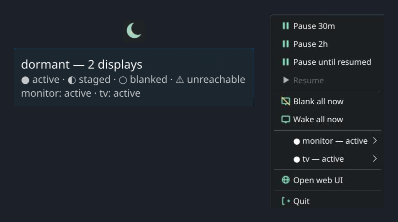

# Installation

## Prerequisites

- Linux (x86_64 or aarch64) with a desktop environment (X11 or Wayland), **or**
  macOS (arm64 or x86_64) — see [macOS (M1)](#macos-m1) below for the
  macOS-specific install path
- Rust 1.88+ (MSRV) if installing from source
- Build dependencies for the full daemon (Linux only — macOS needs nothing
  beyond Xcode Command Line Tools): `sudo apt install libudev-dev libwayland-dev libmpv-dev pkg-config`
- If `pkg-config` cannot find `libudev`, set `PKG_CONFIG_PATH=/usr/lib/pkgconfig`

### Render backend

The software render backend (`render_black`, `render_screensaver` ladder stages)
is off by default. The full build below enables it. For a smaller build, omit
`render` and its `libwayland-dev` / `libmpv-dev` dependencies.

- **Build:** add `--features render` — `cargo build --release --features render`
- **Dependencies:** `libwayland-dev`, `libmpv-dev`, and `pkg-config`
- Without the feature, configs using render stages are rejected at startup with
  `E_RENDER_UNAVAILABLE`; the daemon, CLI, and non-render sensors/displays still
  build and run normally.

## From source

```bash
git clone https://github.com/legion-works/dormant.git
cd dormant
sudo apt install libudev-dev libwayland-dev libmpv-dev pkg-config
cargo build --release --features web-ui,render
install -Dm755 target/release/dormantd ~/.local/bin/dormantd
install -Dm755 target/release/dormantctl ~/.local/bin/dormantctl
```

Binaries land in `~/.local/bin/` — make sure this is on your `PATH`.

### Tray applet (Linux only)

`dormant-tray` is a KDE `StatusNotifierItem` applet: status glance +
pause/resume + blank/wake controls, riding the daemon's Unix socket in
the background.



```bash
install -Dm755 target/release/dormant-tray ~/.local/bin/dormant-tray
```

See [Tray autostart](#tray-autostart) below to run it on every login.

## From release

The cargo-dist pipeline publishes shell installers and tarballs for each binary on every release. Install the latest release (Linux x86_64 / aarch64):

```bash
curl --proto '=https' --tlsv1.2 -LsSf https://github.com/legion-works/dormant/releases/download/v0.1.0/dormantd-installer.sh | sh
curl --proto '=https' --tlsv1.2 -LsSf https://github.com/legion-works/dormant/releases/download/v0.1.0/dormantctl-installer.sh | sh
```

`dormant-tray-installer.sh` is also available in the same directory. Checksums are published alongside every artifact; verify with:

```bash
sha256sum -c dormantd-x86_64-unknown-linux-gnu.tar.xz.sha256
sha256sum -c dormantctl-x86_64-unknown-linux-gnu.tar.xz.sha256
```

## Systemd user unit

dormant runs as a user service — it does not need root. Install the provided unit:

```bash
mkdir -p ~/.config/systemd/user
cp crates/dormantd/systemd/dormant.service ~/.config/systemd/user/
systemctl --user daemon-reload
systemctl --user enable --now dormant
```

Check status:

```bash
systemctl --user status dormant
journalctl --user -u dormant -f
```

The unit runs as `Type=notify`, restarts on failure, and uses a 150-second engine-liveness watchdog. Reload sends `SIGHUP` through `systemctl --user reload dormant`. To stop:

```bash
systemctl --user stop dormant
```

When upgrading from a unit that used `Type=simple`, install the new
`dormantd` binary before copying or reloading the new unit. Then run
`systemctl --user daemon-reload` and `systemctl --user restart dormant`.
See [Watchdog + last-known-good rollback](./watchdog-rollback.md).

## Configuration file location

dormant reads config from these paths, first match wins:

1. `--config` CLI flag
2. `$DORMANT_CONFIG` environment variable
3. `$XDG_CONFIG_HOME/dormant/config.toml` (usually `~/.config/dormant/config.toml`)

MQTT credentials, HA tokens, and Samsung TV tokens go in a separate file with restricted permissions:

```
$XDG_CONFIG_HOME/dormant/credentials.toml
```

Set permissions to `600` — dormant will refuse to load a credentials file readable by others:

```bash
chmod 600 ~/.config/dormant/credentials.toml
```

## Tray autostart

Run `dormant-tray` on every graphical session with the provided user
unit — the same mechanism as the daemon:

```bash
mkdir -p ~/.config/systemd/user
cp crates/dormant-tray/systemd/dormant-tray.service ~/.config/systemd/user/
systemctl --user daemon-reload
systemctl --user enable --now dormant-tray
```

The unit uses `ExecStart=%h/.local/bin/dormant-tray`, so systemd expands
the path from your home directory at launch — no reliance on `PATH`. It
starts after `dormant.service` and restarts on failure. A plain XDG
`.desktop` autostart does not work here: the systemd autostart generator
resolves a relative `Exec=` against a minimal boot `PATH` that excludes
`~/.local/bin`, so no unit gets generated.

## macOS (M1)

dormant runs natively on macOS (arm64 and x86_64), no root required. This
milestone (M1) ships:

- DDC/CI display control (`dormantctl doctor ddcci`)
- The `macos-gamma-black` and `macos-display-sleep` blank controllers
- A CoreGraphics-based idle source
- Read-only diagnostics: `dormantctl doctor macos-idle`,
  `macos-display-sleep`, `macos-power`

`dormant-tray` is also packaged for macOS, but it is **nonfunctional
there** — it is a KDE `StatusNotifierItem` applet with no macOS
equivalent yet. Do not expect tray parity (menu bar icon, pause/blank/wake
from a menu) until M2; install and run `dormantd`/`dormantctl` only.

### From release (macOS)

```bash
curl --proto '=https' --tlsv1.2 -LsSf https://github.com/legion-works/dormant/releases/download/v0.1.0/dormantd-installer.sh | sh
curl --proto '=https' --tlsv1.2 -LsSf https://github.com/legion-works/dormant/releases/download/v0.1.0/dormantctl-installer.sh | sh
```

Binaries land in `~/.local/bin/`, same as Linux. The installer also prints
the next step — it deliberately does not run `dormantctl launchd install`
or `launchctl bootstrap` for you (that would start a background daemon
before you have configured it).

### LaunchAgent (macOS)

dormant ships a per-user `LaunchAgent` — the macOS analog of the systemd
user unit above — as a single checked-in plist,
`crates/dormantd/share/com.legionworks.dormant.plist`. It is staged into
every macOS release archive at that same relative path, and
`dormantctl launchd install` embeds the identical bytes at build time, so
the archived copy and the installed copy are provably the same file.

Install it (idempotent, non-root — writes only under your home directory):

```bash
dormantctl launchd install
```

This atomically copies the plist to the one canonical path,
`~/Library/LaunchAgents/com.legionworks.dormant.plist`, mode `0644`. It
does **not** start the agent — bootstrap it explicitly:

```bash
launchctl bootstrap gui/$UID "$HOME/Library/LaunchAgents/com.legionworks.dormant.plist"
```

Check status and force an immediate (re)start:

```bash
launchctl print gui/$UID/com.legionworks.dormant
launchctl kickstart -k gui/$UID/com.legionworks.dormant
```

Reload config the same way as Linux — signal, not restart:

```bash
launchctl kill HUP gui/$UID/com.legionworks.dormant
```

Logs land at `~/Library/Logs/dormant/dormantd.log` (stdout) and
`dormantd.err.log` (stderr) — the LaunchAgent's `ProgramArguments` create
that directory and redirect into it before `exec`-ing `dormantd`, so the
shell never lingers as a supervisor between launchd and the daemon.

To stop and remove:

```bash
launchctl bootout gui/$UID com.legionworks.dormant
dormantctl launchd uninstall
```

`launchd uninstall` only ever removes that one canonical file — it does
not bootout a still-loaded label, so run `bootout` first or launchd will
keep the last-loaded definition in memory even after the on-disk file is
gone.

**Lifecycle semantics** (see the plist's own comments for the full
rationale):

- `RunAtLoad=true` + `KeepAlive.SuccessfulExit=false`: dormantd starts
  immediately on bootstrap/login and is relaunched whenever it exits,
  except a clean `exit 0`.
- `ThrottleInterval=10`: launchd will not restart dormantd more than once
  every 10 seconds — the only restart-rate control here, this is a
  crash-loop *rate* limiter, not a liveness check.
- **No watchdog parity.** Unlike the systemd unit's `WatchdogSec=150`
  engine-liveness ping, launchd has no built-in mechanism to detect a
  dormantd that is *running but wedged* (hung without exiting). A wedged
  daemon on macOS is invisible to launchd and will not be restarted;
  `dormantctl doctor exercise <display>` and the emergency-wake path (see
  [Troubleshooting](./troubleshooting.md#emergency-wake)) are the operator
  recourse there, independent of the supervisor.
- **Composition with boot-rollback.** The [crash-loop / last-known-good
  rollback logic](./watchdog-rollback.md) is entirely supervisor-agnostic —
  it counts dormantd process starts sharing a config fingerprint within a
  sliding window from its own state files, not from systemd or launchd.
  So on macOS, launchd's 10-second `ThrottleInterval` paces the restarts
  the same way systemd's `RestartSec=2` does on Linux, and the crash-loop
  counter behind it still trips and rolls back to the last-known-good
  config after repeated failed starts — the supervisor differs, the
  rollback guarantee does not.
