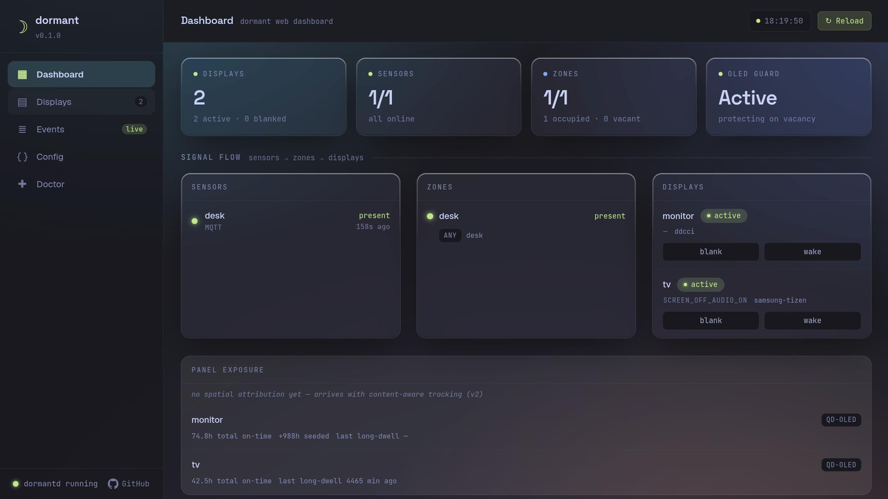

# Web UI

dormant serves an optional web dashboard for live state, control, config editing, panel-wear tracking, failure state, and doctor reports. The SPA is embedded in `dormantd`; it needs no separate static-file server.

## Enabling

The web UI is gated behind the Cargo feature `web-ui`:

```sh
cargo build --release --features web-ui
```

When the feature is enabled, these daemon config keys control the web server:

| Key | Default | Description |
|---|---|---|
| `daemon.web_port` | (unset) | TCP port. Set to a port number to enable the web UI; unset (the default) leaves it disabled. |
| `daemon.web_bind` | `"127.0.0.1"` | Bind address — `127.0.0.1` or `0.0.0.0` |
| `daemon.web_allow_nonloopback` | `false` | Require explicit opt-in before binding to a non-loopback address |
| `daemon.entity_crud_enabled` | `true` | Allow creating/deleting sensors, zones, displays, and rules from the Settings form ([Entity create/delete](#entity-createdelete)) |
| `daemon.pairing_enabled` | `true` | Allow the Samsung pairing wizard ([Pairing wizard](#pairing-wizard)) |
| `daemon.pair_timeout` | `"120s"` | How long the pairing wizard waits for the TV to accept before giving up (`30s`..`300s`) |

Example:

```toml
[daemon]
web_port = 8080
web_bind = "127.0.0.1"
```

If `daemon.web_port` is not set (the default), no HTTP server starts — even when the binary was compiled with the `web-ui` feature. The keys live under `[daemon]`, not a separate `[web]` section.

## Security posture

The web UI is for single-user, loopback-only use. It has no authentication, user sessions, or TLS. Run it on the same machine as `dormantd` and open it from that host.

### Loopback guard

By default the server binds to `127.0.0.1` only. Setting `daemon.web_bind = "0.0.0.0"` (or any non-loopback address) is rejected at startup unless `daemon.web_allow_nonloopback = true`. The daemon logs a prominent warning when this override is active, because it makes the dashboard reachable from the local network without authentication — anyone on the LAN could issue blank/wake commands or change zone config.

### Host guard

The server validates the `Host` header on every request. Requests with a `Host` that does not match the configured bind address are rejected with `403 Forbidden` (the daemon logs a `web_reject_host` event). This blocks DNS-rebinding attacks even when bound to loopback only.

### Origin (CSRF) guard

Every `POST` must carry `Content-Type: application/json`. Beyond that, two different Origin checks apply depending on the route. Most write routes (`/api/blank`, `/api/wake`, `/api/pause`, `/api/resume`, `/api/reload`, `/api/doctor`) accept a same-origin request *or* one with no Origin header at all — a deliberately narrower posture, acceptable for routes that toggle running state rather than write config or credentials. Two routes carry a **strict** check instead: `POST /api/config/apply` and `POST /api/pair/samsung`. On these, the Origin header must be present and must match the bound loopback address and port exactly; an absent Origin is rejected. This closes the classic form-POST/no-Origin CSRF gap for the two routes that write to disk. A residual, honestly stated: a browser extension holding a loopback host permission isn't necessarily bound by page-Origin rules the same way ordinary page script is — a known gap, not claimed defended.

### What this defends, and what it doesn't

The Host and Origin guards defend against DNS rebinding and cross-origin browser CSRF (a malicious page open in the same browser as the dashboard) — the realistic threat for a loopback tool with no login. They do **not** defend against another local process running as the same OS user: anything that can already execute code as the operator can forge `Host`/`Origin` headers and drive every route, including entity creation/deletion and the pairing wizard. This was never in scope for a single-user loopback tool — if an attacker already has code execution as the operator, the config and credentials are theirs regardless of any header check.

A config that passes validation but is functionally unwise (contradictory inhibitors, a rule that can never fire, an absurd grace period) is a **misconfiguration**, not a security hole. Validation checks that a config is structurally and referentially correct, never whether it embodies a sane blanking policy — entity CRUD is the first web surface that lets an operator author such a config from a browser, but the boundary this UI holds is "no invalid or dangling config reaches the running daemon," not "no unwise-but-valid config."

### No upstream exposure

Do not reverse-proxy the dashboard onto the public internet. If remote visibility is needed, use an SSH tunnel (`ssh -L 9100:localhost:9100 user@host`) or a VPN. The dashboard was not designed for hostile-network exposure.

## Views

The SPA has five views, selected from a left-hand navigation sidebar.

### Dashboard



The landing page. Shows a stat row (displays count with active/blanked split, sensor online/unavailable split, zone occupied/vacant split, OLED guard status), a three-column signal-flow grid (Sensors → Zones → Displays), and a recent-activity feed.

Each sensor row shows its id, type, state, and last-seen age. An unavailable sensor that has not delivered data since daemon start is marked "no data since start" from its `reported` diagnostic. Zone rows show occupancy, fusion mode, and members. Display rows show phase, blank mode, controller chain, and blank/wake controls. Failing displays appear in a dashboard banner; tracked displays also get a panel-exposure card.

### Displays

A per-display card list. Each card shows a screen preview glyph (ON / grace / … / OFF / wake), phase and paused/inhibited status chips, the blank mode label, the driving zone and rule, the command generation counter, and the controller chain rendered as HealthChips (each controller's name, role — primary/fallback — and health status). Action buttons let the operator force-blank, force-wake, and pause or resume the governing rule.

### Events

A scrolling, auto-pruning event log. It shows presence changes, display phase transitions, wake retries, blank/wake failures and recoveries, panel-wear advisories, and config reloads. Timestamps use the browser's clock when each WebSocket message arrives. Reloading the page starts a fresh client-side log.

### Config

Two tabs: **Settings** (a form editor for live config changes without touching the TOML file) and **Raw TOML** (the original read-only syntax-highlighted viewer with inventory sidebar and a reload button).

#### Settings tab

The Settings form presents the running config as editable sections: Daemon, Sensors, Zones, Rules, and Displays. Each field shows the current value from `GET /api/config`; edits are accumulated in a client-side patch store and submitted together via `POST /api/config/apply`.

**What is editable (v1):**
- Leaf string, number, and duration values (e.g. `grace_period`, `startup_holdoff`, `hold_time`).
- Whole arrays (e.g. a rule's `displays` list, the `ladder` array-of-tables, screensaver `source` lists). Setting an array replaces it wholesale.
- A limited set of optional keys can be *removed* via the Remove op: `blank_mode`, `degraded_mode`, `dwell`, `order`, `image_duration`, `scale_mode`, `transition`, `transition_duration`, `hold_time`, `stale_timeout`, `ddc_display`, `output`, `wol_mac`, `host`.

**File-only in v1:**
- Display command strings (`wake_command`, `blank_command`), controller lists (`controllers`), and mode lists (`modes`) are not rendered in the Settings form. They are valid targets for the patch API (a direct `POST /api/config/apply` can set them), but the form does not expose controls for them.

**What is not editable:**
- **Locked leaves** — `type` on an existing entity, `blank_data`, and `wake_data` are never writable through the patch API. The form marks them locked and explains why. `type` is set only when an entity is created; changing a sensor type requires delete-and-recreate so type-specific fields cannot be dropped silently.
- **Credentials-redacted fields** — URLs carrying inline userinfo (for example an MQTT `broker_url` with `user:pass@`) are redacted before the response is sent. The form locks the redacted path and its descendants.
- **General credentials editing** — only the Samsung pairing token write (below) goes through the web UI. HA tokens, MQTT credentials, and any other `credentials.toml` content stay file-only.

**Apply → reload flow:**

1. The form computes the patch delta from the user's dirty edits.
2. `POST /api/config/apply` sends the current `fingerprint` plus the patches.
3. The server re-reads the file, checks the fingerprint, validates and applies the patches, writes the new file, backs up the old file, and subscribes to the daemon's reload outcome.
4. The daemon's config-file watcher detects the write, waits through the `reload_debounce` window, then reloads the runtime.
5. The reload outcome is reported back in the apply response.

#### Outcome banners

The apply bar displays one of four outcomes after the request completes:

| Banner | Meaning |
|---|---|
| **✓ Reloaded** | The daemon accepted the new config and rebuilt the runtime successfully. The form clears its dirty state and re-fetches the new fingerprint. |
| **✕ Rejected** | The config was valid at write time but the daemon's reload failed (e.g. assembly error, removed-display verified-wake failure). A detail message names the cause. *The old config is still running; the patched file is on disk.* |
| **pending** | The apply handler waited for the reload outcome but it did not arrive within the timeout (10 s). Normal when `reload_debounce` is large — the daemon coalesces the event and will reload shortly. The form re-fetches immediately; the file was already written. |
| **superseded** | Another writer (a second browser tab, `dormantctl`, or a direct file edit) landed *after* your apply wrote the file. The reload outcome belongs to their write, not yours. |

#### Conflict dialog (409)

If the fingerprint in the apply request does not match the on-disk file (someone else edited the config between your last `GET` and your `POST`), the server returns `409 Conflict`. The Settings form shows a red conflict dialog:

> Config changed on disk — your edits are against an outdated version. Reload the form to get the latest config, or keep editing (your changes will be lost).

**Reload form** discards your edits, re-fetches the fresh config, and refreshes the form. **Keep editing** dismisses the dialog and leaves your dirty edits in place — you can then re-apply (the next attempt will use the current fingerprint, not the stale one).

#### Unsaved-changes guard

While the form has dirty edits, a `beforeunload` browser guard prevents accidental navigation away from the page. Switching from the Settings tab to the Raw TOML tab also triggers a confirmation dialog: *"Discard N unsaved changes?"*. The guard is removed once all edits are applied or discarded.

#### Backups

Every `POST /api/config/apply` that succeeds (the file is written and fsync'd) creates a backup of the previous config file before the atomic rename. Backups are stored in `<config-dir>/backups/` with names derived from the current UTC time plus a random 4-hex-digit suffix:

```
config.toml.2026-07-07T14:22:03Z.a3f1
```

The directory is created with mode `0o700` (owner-only). A rotation policy keeps at most **5** newest backups (sorted by filename, which encodes an RFC 3339 timestamp); older files are deleted after each new backup.

The config-file watcher uses `RecursiveMode::NonRecursive` on the config directory — writes inside `backups/` do *not* trigger a reload.

#### Entity create/delete

Each of the four Settings sections — Sensors, Zones, Displays, Rules — has an **Add** button that opens a creation form, and each entity card has a **Delete** button. Both ride the same apply flow as every other edit (fingerprint check, backup, atomic rename, reload-wait); there is no separate create/delete pipeline to reason about.

Creation and deletion use dedicated `create_entity` and `delete_entity` patch operations. Ordinary `Set` operations cannot create or replace a whole entity table, and they cannot change `type` on an existing entity.

**Entity ids.** An id must be 1–64 characters, start with a lowercase ASCII letter, and contain only `[a-z0-9_-]` afterward. A fixed set of names is reserved and can never be used as an entity id, because the server internals special-case them for unrelated reasons (as an array-of-tables key, a removable-leaf name, a locked-leaf name, or the config-key literal `weights`): `type`, `blank_data`, `wake_data`, `source`, `ladder`, `weights`, `blank_mode`, `degraded_mode`, `dwell`, `order`, `image_duration`, `scale_mode`, `transition`, `transition_duration`, `hold_time`, `stale_timeout`, `ddc_display`, `output`, `wol_mac`, `host`. The id field gives live feedback as you type; the server re-validates independently and is the real boundary. An id that collides with an existing entity in the same collection is rejected.

**What each collection accepts at creation.** The create form only exposes fields from a fixed, closed list per collection — there is no free-form "add any key" path:
- **Sensors** — a `type` discriminator (`mqtt`, `ha`, or `usb-ld2410`, selectable only at creation — never changeable afterward) plus the fields for the chosen type, `kind`, `hold_time`, `stale_timeout`.
- **Zones** — `mode`, `members`, `unavailable_policy`, `weights`.
- **Displays** — `controllers`, `host`, `blank_mode`, `output`, `ddc_display`, `wol_mac`, `samsung_restore_backlight`, `restore_brightness`, `treat_unreachable_as_blanked`, `command_timeout`. `wake_command`/`blank_command` are deliberately not offered here (or anywhere in the create path) — they are daemon-executed shell commands, and a web-created display cannot carry an arbitrary shell command in v1. A display that needs a command controller is still authored by hand in `config.toml`, exactly as before this feature.
- **Rules** — `zone`, `displays`, `grace_period`, `inhibitors`, and the timing tunables.

**Cross-references.** Now that entities can be minted from the browser, the rule fields that name other entities — `zone`, `displays`, `members`, `inhibitors` — are editable dropdowns/multi-selects populated from the live inventory, instead of the read-only fields they were before this feature.

**Delete.** Deleting shows a confirmation naming anything in the currently-loaded config that references the entity (a client-side, best-effort check — it only knows what's in the form's inventory). The real reference-integrity guarantee is server-side: if a delete would orphan a reference (a rule pointing at a deleted zone or display, a zone listing a deleted sensor), the daemon-identical validation step at apply time rejects the whole request with `422` and the on-disk config is untouched. There's no separate reference-checking code path in the web layer to drift from the daemon's own rules.

**The `entity_crud_enabled` flag.** Set `daemon.entity_crud_enabled = false` to turn this off; the UI hides the Add/Delete affordances, but the server is the actual boundary — a `create_entity`/`delete_entity` patch sent while the flag is off is rejected with `403 feature_disabled` regardless of what the UI shows. Ordinary `Set`/`Remove` edits are unaffected by this flag.

### Pairing wizard

The Settings tab includes a **Pair a Samsung TV** card that walks through the network-pairing handshake `dormantctl pair samsung` performs from the command line, without leaving the browser.

1. Enter the TV's hostname or IP address and click **Pair**. The server responds immediately (it never blocks the request on the TV) with an opaque `pair_id`, and the browser starts polling `GET /api/pair/samsung/<pair_id>` about once a second.
2. While the attempt is in flight, the wizard shows "Connecting… accept the prompt on your TV" — the daemon can't distinguish "still connecting" from "waiting for you to press Allow" (both are the same blocking network call), so this message covers both.
3. **Accept the "Allow dormant" prompt on the TV** when it appears. If you don't, the attempt eventually times out (`daemon.pair_timeout`, default `120s`, configurable `30s`–`300s`) and the wizard shows a timeout message with a **Try again** button — pairing is not automatically retried.
4. On success, the granted token is written to `credentials.toml` (mode `0600`, atomic temp-file-plus-rename, same code path `dormantctl pair` uses) and the wizard offers to pre-fill a new display entity for that host (`controllers: ["samsung-tizen"]`) using the [entity create form](#entity-createdelete) above. Declining still leaves the token stored — an unused Samsung token in credentials is harmless.

**What never leaves the daemon:** the pairing token is never present in any HTTP response body, and never appears in a log line — the code represents it with a type whose `Debug`/`Display` implementations redact to `***`, so even an accidental log format string can't leak it.

**Concurrency.** Only one pairing attempt runs at a time (server-wide). A second `POST /api/pair/samsung` while one is already in flight gets an immediate `409 pairing_in_progress` — it never queues behind the first attempt or blocks waiting for it.

**The `pairing_enabled` flag.** Set `daemon.pairing_enabled = false` to turn this off; the UI hides the wizard, and the server independently rejects `POST /api/pair/samsung` with `403 feature_disabled` if called anyway.

**Security notes specific to this route.** `POST /api/pair/samsung` carries the same strict Origin check as `/api/config/apply` (see [Origin (CSRF) guard](#origin-csrf-guard) above) — without it, a malicious page open in the operator's browser could trigger a pairing attempt against an attacker-chosen host. Its request body is capped at 4 KiB (a hostname is tiny; there's no reason to accept more). None of this changes the underlying trust assumption: pairing connects to whatever host the operator types, with TLS certificate verification disabled (the token is what authenticates the connection, not the certificate — the same posture the CLI pairing path and the ongoing Samsung control connection already use). Pointing the wizard at the wrong device is an operator mistake, not something the wizard can detect.

### Doctor

Runs the same diagnostic checks as `dormantctl doctor` on demand. The SPA calls `POST /api/doctor`, which invokes the shared `DoctorService` directly (the same service instance the daemon's IPC server uses — no subprocess is spawned). Results include a summary bar (passing / skipped / failing counts) and per-check rows with status chips and detail messages.

The web doctor view does not run the destructive control-path exercise. Use
`dormantctl doctor exercise <display>` when you need to prove that a real panel
blanked and woke.

## Audio-aware blanking

The Settings form renders the `[audio]` section, and rule editors accept
`"audio-playback"` and `"call"` inhibitors. A rule that declares either kind
spawns a PipeWire poller (`pw-dump` every `[audio].poll_interval`): while a
matching stream is playing, the rule is inhibited and its displays stay awake
even when the room reads vacant. Deassertion is immediate when playback stops.
A rule that declares no audio inhibitor spawns no poller. See
[Configuration → `[audio]`](./configuration.md) for the classification knobs
(`call_roles`, `playback_roles`, `capture_is_call`, `min_active`).
